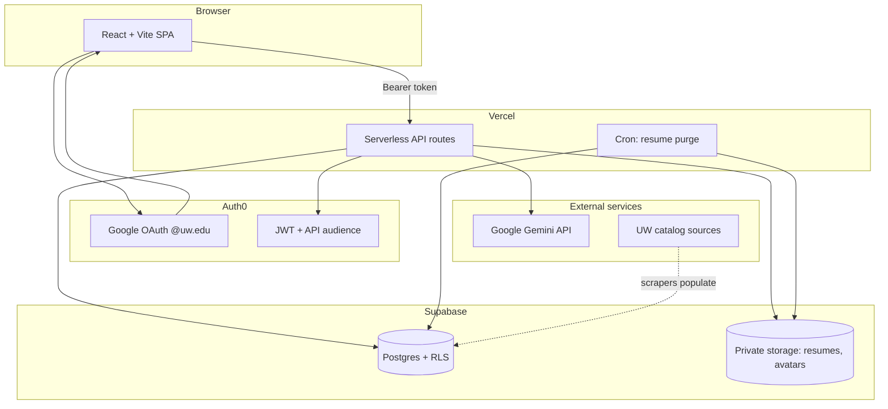
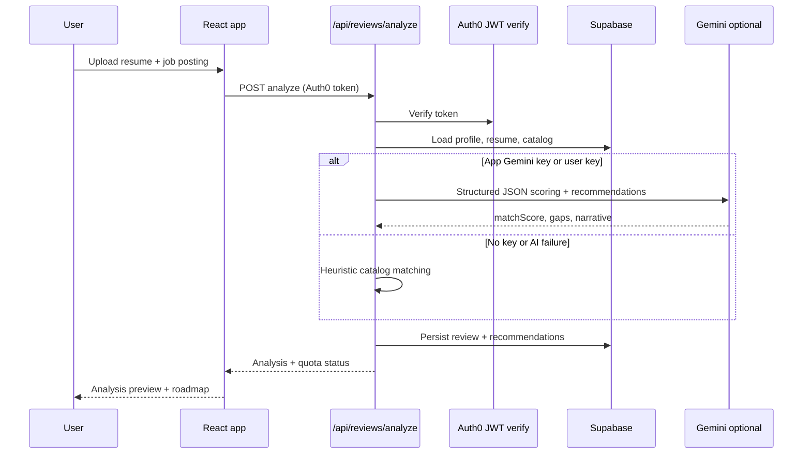

# Husky-Review

**Live application:** [https://husky-review.vercel.app](https://husky-review.vercel.app)

Husky-Review is an actionable resume review tool for the University of Washington community. Students upload a resume and job posting, receive a structured gap analysis, and get recommendations grounded in **verified UW activities**—clubs, courses, events, fellowships, and research—with source links, campus labels, and a week-by-week roadmap.

Access requires a **@uw.edu** Google account. The workspace is private to signed-in users; the public homepage explains the product before sign-in.

---

## Project Overview

Generic resume tools often suggest clubs, courses, or certifications that do not exist at a student’s campus or are no longer active. Husky-Review closes that gap by combining resume and job-posting analysis with a curated catalog of UW opportunities that include verification metadata (active status, last-verified date, and source URL).

**Who it serves:** UW students preparing for internships, co-ops, or full-time roles who want concrete next steps—not generic advice.

**What students get:**

- A **match score** and three gap views: missing skills, keyword gaps, and experience signals.
- **In-Time** and **Next-Time** recommendations tied to real UW listings (HuskyLink, Gather UWB, course schedules, scraped org data).
- A **three-week roadmap** built from selected recommendations.
- **Saved reviews** and resumes in an account-backed workspace.

**Impact:** Recommendations are scoped to the student’s home campus by default, with an optional setting to include strong fits from Seattle, Bothell, and Tacoma. Campus is inferred from authoritative source URLs so Seattle HuskyLink organizations are not mislabeled as Bothell.

---

## User Guide

### 1. Sign in

1. Open [https://husky-review.vercel.app](https://husky-review.vercel.app).
2. Click through to the app and **Continue with Google** using your **@uw.edu** account.

### 2. Complete your profile (first time)

Before your first review, set:

- **Display name**
- **Major**
- **Campus** (Seattle, Bothell, or Tacoma)

Optional preferences under **Profile → Review preferences**:

- **Recommend from other campuses** — include Seattle/Bothell/Tacoma when the match is strong.
- **Prioritize In-Time activities** — surface deadline-friendly actions first.
- **Include long-term opportunities** — show Next-Time items for future cycles.

### 3. Run a review

1. Go to the **Dashboard** (`/app`).
2. **Upload a resume** (PDF, DOC, or DOCX) or choose a previously saved file.
3. Add a **job description** (paste text) or a **job posting URL**.
4. Set an **application deadline** (optional but improves In-Time vs Next-Time grouping).
5. Click **Analyze**.

After analysis finishes, the page scrolls to **Analysis preview** with your match score and gap categories. Browse **Resources** for full recommendation cards, and **Roadmap** for the weekly plan.

### 4. Use your results

| Area | What to do |
|------|------------|
| **Analysis preview** | Read match score, gap tags, and summaries. |
| **Resources** | Compare verified activities; toggle items into your plan. |
| **Roadmap** | Follow week-by-week actions for selected recommendations. |
| **Saved reviews** | Reopen past reviews or delete history you no longer need. |

### 5. Optional: your own Gemini API key

If the shared weekly AI quota is used up, paste a **Google AI Studio** API key in the review panel (optional). The key is sent only for that request and is **not stored**. Use **Test API key** to confirm it works. Usage appears under your own Google AI Studio project.

### 6. Privacy notes

- Resumes are stored in a **private** Supabase bucket per account.
- Uploads not linked to a saved review may be removed by scheduled cleanup after a retention period.
- Resumes attached to saved reviews remain until you delete them.
- See **Legal** on the site for privacy and terms.

---

## Technical Overview

### System architecture



### Review analysis pipeline



### Tech stack

| Layer | Technology |
|-------|------------|
| **Frontend** | React 19, TypeScript, Vite, Tailwind CSS, React Router |
| **Hosting** | Vercel (SPA + serverless functions) |
| **Authentication** | Auth0 (Google connection, @uw.edu restriction) |
| **Database** | Supabase Postgres with Row Level Security |
| **File storage** | Supabase Storage (`resumes`, `avatars` buckets) |
| **AI** | Google Gemini (`gemini-2.5-flash` primary) with deterministic fallback |
| **Analytics** | Vercel Analytics & Speed Insights |

### Application routes

| Route | Access | Purpose |
|-------|--------|---------|
| `/` | Public | Marketing homepage |
| `/legal` | Public | Privacy & terms |
| `/app` | Signed-in | Dashboard & review workflow |
| `/app/profile` | Signed-in | Profile, campus, preferences, avatar |
| `/app/resources` | Signed-in | Recommendation browser |
| `/app/roadmap` | Signed-in | Weekly action plan |
| `/app/saved-reviews` | Signed-in | Review & resume history |

### Data model (high level)

- **`profiles`** — campus, major, review preferences, completion marker.
- **`resumes`** — file metadata and storage paths (Auth0 `sub` scoped).
- **`reviews`** — analysis snapshots (match score, gaps, recommendations, roadmap).
- **`activities`**, **`campus_orgs`**, **`course_sections`** — verified UW catalog (merged and deduplicated at analyze time).
- **`review_ai_usage_limits`** — weekly app-key quota per user (server-only RPCs).

Catalog campus labels are reconciled using source hostnames (e.g. HuskyLink → Seattle, Gather UWB → Bothell). Scrapers under `data/scraper/` refresh org and schedule data.

### Security highlights

- API routes verify **Auth0 JWTs**; service-role Supabase access stays on the server.
- **RLS** isolates user-owned rows; quota functions run as `SECURITY INVOKER` with execute limited to `service_role`.
- Job posting URLs are fetched with **SSRF protections** (private IP blocking, redirect limits).
- Resume uploads are type-checked; Gemini prompts treat user content as **untrusted data** (instruction-tuning resistant copy).

---

## AI Integration

### Design goals

1. **Ground answers in the catalog** — Gemini chooses from pre-ranked verified activities, not hallucinated clubs.
2. **Stay within token limits** — resume and job text are trimmed; only top catalog candidates are sent.
3. **Fail gracefully** — if Gemini is unavailable, the same pipeline uses deterministic matching so the UI still works.

### Key resolution

| Mode | Behavior |
|------|----------|
| **App key** | Server `GEMINI_API_KEY` on Vercel. **2 AI reviews per user per 7-day window** (Postgres quota RPCs). |
| **User key** | Optional paste in the UI; request-only, never stored. No app quota consumption. |
| **No key / error** | **Deterministic** analysis: token overlap, skill signals, catalog ranking—no external AI call. |

User-key mode uses only the pasted key (server key is not mixed in). Students can verify keys via `/api/gemini-verify`.

### Model and API behavior

- **Models tried in order:** `gemini-2.5-flash` → `gemini-2.5-flash-lite` → `gemini-2.0-flash`.
- **Output:** JSON via `responseMimeType: application/json`, temperature `0.2`.
- **Gemini 2.5:** `thinkingBudget: 0` so reasoning tokens do not truncate JSON.
- **Retries:** higher `maxOutputTokens` on truncation (`MAX_TOKENS`).

### Two-step Gemini flow

1. **Scoring** — `matchScore` + exactly three `gapCategories` (skills, keywords, experience).
2. **Recommendations** — narrative `whyItHelps`, tags, confidence, roadmap hooks for catalog IDs already ranked heuristically.

Results are merged with a **heuristic baseline** so IDs, campus, sources, and verification dates stay consistent with the database. Invalid or unknown activity IDs from the model are dropped.

### Catalog feeding the model

Before any AI call, the server:

1. Loads activities, `campus_orgs`, and `course_sections` (filtered by campus unless cross-campus is enabled).
2. **Dedupes** by name (scraped org rows preferred over stale `activities` rows).
3. **Ranks** by keyword/skill overlap, embedding-style cosine similarity, and home-campus boost.
4. Sends up to **8–18** candidates (more when cross-campus is on) with short descriptions.

### What the UI shows when AI is not used

The analysis card states when the run used **local catalog matching** instead of Gemini (missing server key, quota, or API error). User-supplied key errors surface a clear message without blocking the deterministic fallback.

---

## For developers

### Local setup

```bash
npm install
cp .env.example .env
npm run dev
```

For full API routes locally (analyze, gemini-verify, profile), use:

```bash
npm run dev:vercel
```

Or set `VITE_API_PROXY=https://husky-review.vercel.app` in `.env` while running `npm run dev`.

```bash
npm test          # unit tests
npm run build     # production build
```

Apply Supabase migrations in timestamp order under `supabase/migrations/` before running analysis against a real project.

### Documentation

| Document | Audience |
|----------|----------|
| [DEPLOYMENT_CHECKLIST.md](./DEPLOYMENT_CHECKLIST.md) | Operators deploying to Vercel + Auth0 + Supabase |
| [SUPABASE_OWNER_SETUP.md](./SUPABASE_OWNER_SETUP.md) | Database owner setup |
| [docs/proposal.md](./docs/proposal.md) | Original project proposal & research context |

### Repository branches

- **`development`** — integration branch (preview deploys).
- **`main`** — production-aligned release branch.

---

## License & attribution

Built for the UW community. For questions about the deployed instance, start from the live app and profile/settings flows above; for infrastructure, see the deployment docs linked in **For developers**.
