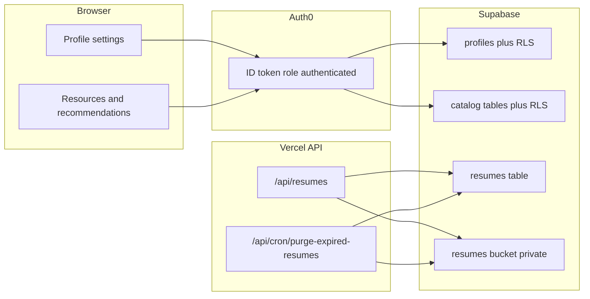

# Husky-Review — Supabase setup handoff

This document is for the **Supabase project owner**. It describes what to configure in the Supabase dashboard so the Husky-Review app (Auth0 + Vercel) can store profile settings, private resume files, and **read your existing UW catalog** (classes, activities, clubs, courses, events, and related tables).

**Production app:** https://husky-review.vercel.app  
**Auth0 tenant (for Third-Party Auth):** `dev-gamqgs47xldlc3hi.us.auth0.com`  
**Schema source of truth in repo:** `supabase/migrations` applied in timestamp order. `supabase/schema.sql` is a legacy profile/resume bootstrap reference.

---

## How the app uses Supabase

| Feature | Who authenticates | How Supabase is accessed |
|---------|-------------------|---------------------------|
| Profile settings (browser) | Auth0 ID token via **Third-Party Auth** | Anon key + RLS on `public.profiles` |
| UW catalog (classes, activities, etc.) | Auth0 ID token (signed-in `@uw.edu`) | Anon key + RLS — **read-only** `SELECT` for `authenticated` |
| Resume upload / list / delete | Auth0 access token → **Vercel API** | **Service role** key (server only); API filters by Auth0 user id |
| Review history and AI quota | Auth0 access token through **Vercel API** | **Service role** key (server only); review rows are account-scoped |
| Scheduled resume cleanup | Vercel cron job | **Service role** deletes rows + storage objects |

Users sign in with **Google only** and **`@uw.edu` emails only** (enforced in Auth0, not Supabase Auth).



---

## Checklist (please complete in order)

- [ ] **1.** Confirm project exists; share API credentials with the app team (see below)
- [ ] **2.** Enable **Auth0 Third-Party Auth**
- [ ] **3.** Apply all SQL files in `supabase/migrations` in timestamp order
- [ ] **4.** Confirm Storage bucket `resumes` is **private**
- [ ] **5.** Confirm RLS is enabled on tables and storage policies
- [ ] **6.** Run verification SQL and report results
- [ ] **7.** Run **catalog discovery** SQL (section 10) and send table/column inventory to the app team
- [ ] **8.** Mark which tables are **student-facing catalog** vs internal/embedding-only
- [ ] **9.** Enable **read-only RLS** on catalog tables (or a unified view) for `authenticated`
- [ ] **10.** Note whether **pgvector** / embedding columns exist (for future analysis API)

---

## 1. API credentials to share with the app team

In **Project Settings → API**, copy these values and send them through your team’s **secure** channel (1Password, etc.). Do **not** post the service role key in Slack/email if avoidable.

| Supabase value | Environment variable | Where it is used |
|----------------|----------------------|------------------|
| Project URL | `VITE_SUPABASE_URL` | Browser (Vercel env) |
| Project URL | `SUPABASE_URL` | Vercel serverless functions |
| `anon` `public` key | `VITE_SUPABASE_ANON_KEY` | Browser |
| `service_role` key | `SUPABASE_SERVICE_ROLE_KEY` | **Vercel only** — never expose to frontend |

The Vercel project `devghostys-projects/husky-review` may already have `SUPABASE_URL` and `SUPABASE_SERVICE_ROLE_KEY`. Please confirm they are set and non-empty for **Preview** and **Production**.

---

## 2. Auth0 Third-Party Auth (required for profiles)

Profile settings in the app use the Auth0 **ID token** as the Supabase JWT. Supabase must trust Auth0 as a third-party identity provider.

1. Open **Authentication** → **Third-Party Auth** (menu name may vary: **Auth Providers**, **JWT**, etc.)
2. Add an **Auth0** integration
3. Configure the Auth0 tenant domain: **`dev-gamqgs47xldlc3hi.us.auth0.com`**
4. Enable the integration for this project

### Auth0 requirement (configured by app team, not in Supabase)

Auth0’s post-login Action must set this on the **ID token** (not only the access token):

```js
api.idToken.setCustomClaim('role', 'authenticated');
```

Supabase RLS policies expect:

- JWT role: `authenticated`
- JWT `sub`: Auth0 user id (e.g. `google-oauth2|...` or `auth0|...`)

If profile settings do not persist after login, coordinate with the Auth0 admin to confirm the Action is deployed.

---

## 3. Run database migrations

1. Open **SQL Editor** → **New query**
2. Apply the SQL files in **`supabase/migrations`** from oldest timestamp to newest timestamp
3. Click **Run** for each file

The migration scripts are idempotent (`if not exists`, `drop policy if exists`). Safe to run more than once.

### What it creates

| Object | Purpose |
|--------|---------|
| `public.profiles` | Per-user profile preferences |
| `public.resumes` | Resume metadata (filename, path, size, etc.) |
| `public.reviews` | Saved review summaries and structured analysis payloads |
| `public.review_recommendations` | Normalized recommendation rows for each review |
| `public.review_roadmap_actions` | Normalized roadmap action rows for each review |
| `public.review_ai_usage_limits` | Weekly app-key AI quota counters |
| `resumes_auth0_user_id_created_at_idx` | List resumes per user |
| `resumes_created_at_idx` | Scheduled cleanup support |
| RLS policies | Users only see their own rows (`auth.jwt()->>'sub'`) |
| Storage bucket `resumes` | Private file storage |
| Storage RLS policies | Files under `{auth0_user_id}/...` only |

### If schema was partially applied earlier

Run at least this index if missing:

```sql
create index if not exists resumes_created_at_idx
  on public.resumes (created_at);
```

---

## 4. Storage bucket

Go to **Storage → Buckets** and confirm:

| Setting | Required value |
|---------|----------------|
| Bucket name / id | `resumes` |
| Public | **Off** (private bucket) |

Expected object paths: `{auth0_user_id}/{timestamp}-{filename}` (created by the Vercel API).

---

## 5. Row Level Security verification

### Tables

In **Table Editor** → `profiles` and `resumes` → confirm **RLS enabled**.

Policies should restrict access with:

```sql
auth0_user_id = (select auth.jwt() ->> 'sub')
```

(storage uses the first path segment of `name` instead of `auth0_user_id`)

### Verification queries

Run in **SQL Editor** and keep the output for the app team:

```sql
-- RLS enabled?
select tablename, rowsecurity
from pg_tables
where schemaname = 'public'
  and tablename in ('profiles', 'resumes');

-- Indexes present?
select indexname
from pg_indexes
where schemaname = 'public'
  and tablename = 'resumes'
order by indexname;

-- Bucket exists and is private?
select id, name, public
from storage.buckets
where id = 'resumes';
```

**Expected:**

- `profiles` and `resumes`: `rowsecurity = true`
- Indexes include `resumes_auth0_user_id_created_at_idx` and `resumes_created_at_idx`
- Bucket `resumes`: `public = false`

---

## 6. What is *not* required in Supabase

- **Supabase Auth email/password or magic link** — login is Auth0 + Google only
- **Supabase Cron / Edge Functions** for resume deletion — handled by Vercel cron calling `/api/cron/purge-expired-resumes`
- **Making the `resumes` bucket public** — must stay private; the API returns short-lived signed URLs

---

## 7. Resume retention (1 hour)

The app deletes resume rows and storage files older than **one hour**. Deletion is triggered by a **Vercel cron** (not Supabase cron):

- Endpoint: `/api/cron/purge-expired-resumes`
- Schedule on current Vercel Hobby plan: **once daily** at 08:00 UTC (`0 8 * * *`)
- Requires `resumes_created_at_idx` and valid `SUPABASE_SERVICE_ROLE_KEY` on Vercel

Purging more frequently would require a Vercel Pro plan or a manual/API-triggered purge.

---

## 8. Troubleshooting

| Symptom | Likely cause in Supabase |
|---------|--------------------------|
| Profile changes lost on refresh | Third-Party Auth for Auth0 not enabled, or ID token missing `role: authenticated` |
| Resume API returns 500 / “configuration missing” | `SUPABASE_URL` or `SUPABASE_SERVICE_ROLE_KEY` missing on Vercel |
| User sees empty saved resumes | No rows in `public.resumes`, or API/auth issue (check Table Editor) |
| Old resumes never deleted | Missing `resumes_created_at_idx`, or Vercel cron/`CRON_SECRET` not configured (app team) |
| Signed-in user sees no campus activities | Catalog RLS missing, wrong grants, or discovery inventory not shared with app team |
| Catalog visible without signing in | `SELECT` granted to `anon` — restrict to `authenticated` only |

---

## 9. Existing UW catalog (classes, activities, and related tables)

The Husky-Review migrations include the current `activities`, `course_sections`, and `campus_orgs` tables. If the production database has additional verified UW content, the app team needs your help to **document** what exists and **expose read-only access** for signed-in students.

**Access model:** catalog is **read-only in the browser** for any signed-in `@uw.edu` user — same as profiles: **anon key + Auth0 ID token + RLS**. Students do not write catalog rows from the SPA; ingestion stays in the dashboard or your pipelines.

Profile preferences in `public.profiles` include `activity_interests` (`club`, `course`, `event`, `fellowship`, `project`, `research`). Once connected, the app will filter catalog results using those interests.

### 9.1 Discovery — run in SQL Editor

Run these queries and **send the output** to the app team (secure channel). Replace `<TABLE_NAME>` for each catalog table you identify.

```sql
-- List all public tables
select table_name
from information_schema.tables
where table_schema = 'public'
  and table_type = 'BASE TABLE'
order by table_name;

-- Columns for one table (repeat per catalog table)
select column_name, data_type, is_nullable
from information_schema.columns
where table_schema = 'public'
  and table_name = '<TABLE_NAME>'
order by ordinal_position;

-- Optional: embedding / vector columns (for future AI retrieval)
select table_name, column_name
from information_schema.columns
where table_schema = 'public'
  and udt_name in ('vector', 'halfvec');
```

**Deliverable:** fill in a table like this and return it to the app team:

| Table | Purpose (your description) | Approx. row count | Notes |
|-------|----------------------------|-------------------|-------|
| e.g. `classes` | UW courses | | |
| e.g. `activities` | clubs, events, research | | |

Also note:

- Which tables are **student-facing** (show in the app) vs **internal only** (embeddings, ingestion logs, admin)
- Foreign keys or shared columns if data is split across multiple tables

### 9.2 Fields the app will map (no renames required yet)

The app displays recommendations using this shape (see `src/types/analysis.ts` in the repo). Your column names can differ; the app team will map them.

| App field | Suggested DB source (flexible) |
|-----------|--------------------------------|
| `id` | Primary key or stable slug |
| `name` | Title / name column |
| `type` | One of: `club`, `course`, `event`, `fellowship`, `project`, `research` |
| `active` | Boolean or status flag |
| `lastVerified` | `last_verified` or similar (date/timestamptz) |
| `sourceLabel` | Source name or URL label |
| `tags` | `text[]` or JSON array of keywords/skills |
| `whyItHelps` | Description / summary (optional; app can default text if missing) |
| `group`, `confidence`, `roadmapWeek`, `roadmapAction` | **Computed in the app** until the analysis API exists |

If you use separate tables for courses vs clubs vs events, document how they relate. The app can query multiple tables or a single view (below).

### 9.3 Read-only RLS on catalog tables

After discovery, enable RLS on each **student-facing** catalog table. Allow **select only** for `authenticated`; do **not** allow insert/update/delete from the browser.

Replace `<table_name>` for each table:

```sql
alter table public.<table_name> enable row level security;

drop policy if exists "<table_name>_select_authenticated" on public.<table_name>;
create policy "<table_name>_select_authenticated"
  on public.<table_name>
  for select
  to authenticated
  using (true);

-- Optional: hide inactive rows in the database
-- using (active = true);

grant select on public.<table_name> to authenticated;
```

**Important:**

- Do **not** grant catalog `SELECT` to unauthenticated `anon` users.
- Tables that hold **embeddings only** or ingestion metadata should **not** get the policy above unless the app team explicitly requests it (likely server-only later).

### 9.4 Optional: unified view

If the catalog spans multiple tables, you may create one read surface for the app (column names must align across branches):

```sql
-- Example only — adjust to your real table and column names after discovery
create or replace view public.uwb_activities_catalog as
  select id, name, type, active, last_verified, source_label, tags, description
  from public.activities
  union all
  select id, name, 'course'::text, active, last_verified, source_label, tags, description
  from public.classes;
```

If you add a view, apply the same RLS pattern on the view (or document that the app should query underlying tables).

### 9.5 Catalog verification

After RLS is applied, run (adjust table names):

```sql
-- RLS enabled on catalog tables?
select tablename, rowsecurity
from pg_tables
where schemaname = 'public'
  and tablename not in ('profiles', 'resumes')
order by tablename;
```

The app team will verify reads from the SPA after your inventory is delivered.

---

## 10. Handback to the app team

When finished, please confirm:

1. Auth0 Third-Party Auth is **enabled** (tenant domain noted above)
2. `supabase/migrations` have been **run successfully in timestamp order**
3. Bucket `resumes` is **private**
4. Verification SQL output (section 5) looks correct
5. API credentials were shared securely (or confirmed existing Vercel env vars are correct)
6. **Catalog discovery** output (section 9.1) and table inventory delivered
7. **Read-only RLS** on student-facing catalog tables (section 9.3) is applied
8. Whether **pgvector** / embeddings are in use (for future analysis work)

**App team contacts / repo:** Husky-Review — see also `INTEGRATION_GUIDE.md` and `DEPLOYMENT_CHECKLIST.md` for full stack setup. After you share the catalog schema, the app team will wire the UI to live data (replacing mock recommendations).

---

*Last updated: Husky-Review security hardening plus UW catalog handoff (classes, activities, read-only authenticated RLS).*
